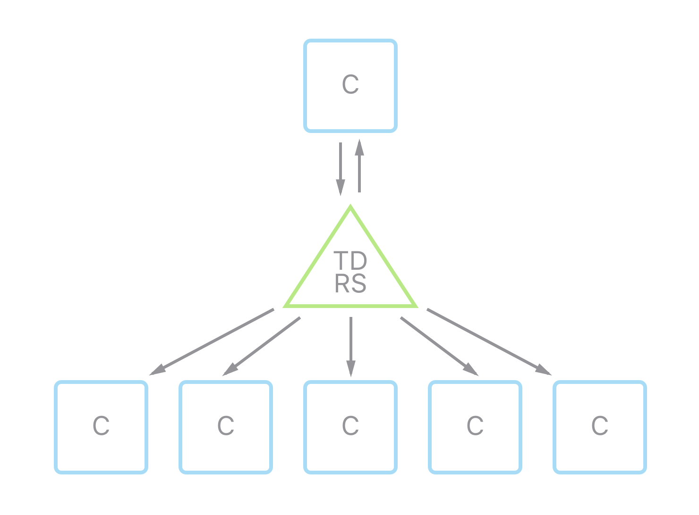

# Weltraum TDRS
Weltraum TDRS is a lightweight ZeroMQ-based event hub.

## A what?

TDRS allows distribution/publishing of events (basically messages) to a large amount of subscribers.



## Okay, how does it work?

Every component (`C`) is connected to the `TDRS` service using a [ZeroMQ](http://zeromq.org) [`ZMQ_SUB` socket](http://api.zeromq.org/4-0:zmq-socket#toc10). Additionally, each component eventually connects to the `TDRS` service using a dedicated [`ZMQ_REQ` socket](http://api.zeromq.org/4-0:zmq-socket#toc4). This connection allows each component to submit an event that gets broadcasted to all subscribed components, **including itself**. By its very nature, the publisher/subscriber-pattern does not allow for the subscribers to directly return a result to the component triggering the event. Therefor, this architecture expects components to react to each other using only events (instead of direct communication), pushing the whole infrastructure-design into a more micro-service-oriented direction.

## Is it [web scale](https://www.youtube.com/watch?v=b2F-DItXtZs)?

Yes.

## Can I haz a GIF?

Sure.


## How can I build it?

```bash
$ autoreconf -i
```

```bash
$ ./configure
```

```bash
$ make
```

## How can I run it?

### Usage

```
Options::
  --help                    show this usage information
  --receiver-listen arg     set listener for receiver
  --publisher-listen arg    set listener for publisher
  --chain-link arg          add a chain link, specify one per link
  --discovery               enable auto discovery of chain links
  --discovery-interval arg  set the auto discovery interval (ms), default 1000
  --discovery-interface arg set the network interface to be used for auto
                            discovery, e.g. eth0
  --discovery-port arg      set the UDP port to be used for auto discovery,
                            default 5670
  --discovery-key arg       set the auto discovery key, default 'TDRS'
```

### Single link

```bash
$ ./tdrs --receiver-listen "tcp://*:19890" --publisher-listen "tcp://*:19891"
```

### Static multi-link

```bash
$ ./tdrs --receiver-listen "tcp://*:19790" --publisher-listen "tcp://*:19791" --chain-link "tcp://127.0.0.1:19891" --chain-link "tcp://127.0.0.1:19991"
```

```bash
$ ./tdrs --receiver-listen "tcp://*:19890" --publisher-listen "tcp://*:19891" --chain-link "tcp://127.0.0.1:19791" --chain-link "tcp://127.0.0.1:19991"
```

```bash
./tdrs --receiver-listen "tcp://*:19990" --publisher-listen "tcp://*:19991" --chain-link "tcp://127.0.0.1:19891" --chain-link "tcp://127.0.0.1:19791"
```

### Dynamic multi-link

```bash
$ ./tdrs --receiver-listen "tcp://*:19790" --publisher-listen "tcp://*:19791" --discovery
```

```bash
$ ./tdrs --receiver-listen "tcp://*:19890" --publisher-listen "tcp://*:19891" --discovery
```

```bash
./tdrs --receiver-listen "tcp://*:19990" --publisher-listen "tcp://*:19991" --discovery
```

## What does `TDRS` stand for?

It stands for ["Tracking and data relay satellite"](https://en.wikipedia.org/wiki/Tracking_and_data_relay_satellite). We at [Weltraum](https://weltraum.co) like to give our components names that sort of fit their function inside our infrastructure, from an astronautics point of view.
